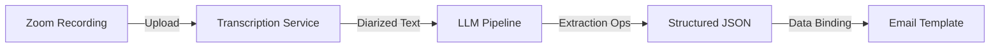

# Weekly Wrap: Development Specification

**Version:** 1.0  
**Last Updated:** January 2025  
**Owner:** PLUS Engineering

---

## 1. Overview

This specification defines the pipeline architecture for generating the Weekly Wrap. It manages the flow from raw Zoom recordings to the structured JSON that powers the email template.

### Pipeline Flow

---

## 2. Input Data

The pipeline consumes two primary inputs:

1.  **Session Transcript:** Time-stamped, speaker-diarized text (Whisper/AssemblyAI).
2.  **Session Metadata:** Context including `tutor_id`, `session_date`, and `recording_count`.

See [PRD](PRD.md) for data source details.

---

## 3. Output Data

The pipeline outputs a single JSON object per tutor per week.

*   **Schema:** See [Appendix: JSON Schema](appendix/json_schema.md)
*   **Validation:** All optional fields must default to safe values (e.g., `highlight_quote: null`).

---

## 4. Extraction Logic

The LLM (Claude/GPT-4) performs specific extraction and analysis tasks to derive behavioral metrics.

*   **Metric Rules:** See [Appendix: Extraction Rules](appendix/extraction_rules.md)
*   **Archetype Logic:** See [Appendix: Extraction Rules](appendix/extraction_rules.md)
*   **Insight Generation:** See [Appendix: Extraction Rules](appendix/extraction_rules.md)

---

## 5. System Architecture

### Components
1.  **Ingestion Service:** Monitors S3/Zoom for new recordings.
2.  **Processing Worker:** Runs the python extraction scripts.
3.  **LLM Gateway:** Manages prompts and retries with the model provider.
4.  **Notification Service:** Generates HTML from JSON and sends via SendGrid/Mailchimp.

### Error Handling
- **Partial Failure:** If one session fails, aggregate the rest.
- **Total Failure:** If no sessions processed, trigger alert; do NOT send empty email.
- **Sanitization:** All free-text inputs (quotes, names) must be escaped to prevent HTML injection.

---

## 6. Testing

### Unit Tests
- Validation of metric calculations against golden set transcripts.
- JSON schema validation for all outputs.

### Integration Tests
- End-to-end run with synthesis mock data.
- Visual regression testing of generated HTML across clients (Litmus/Email on Acid).

---

## References

- [Product Requirements (PRD)](PRD.md)
- [Design Specification](design_spec.md)
- [Appendix A: JSON Schema](appendix/json_schema.md)
- [Appendix B: Extraction Rules](appendix/extraction_rules.md)
- [Appendix C: Style Guide](appendix/style_guide.md)
